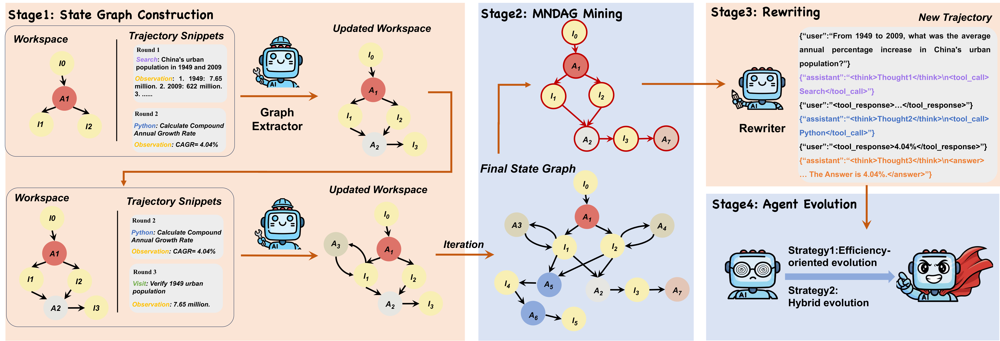
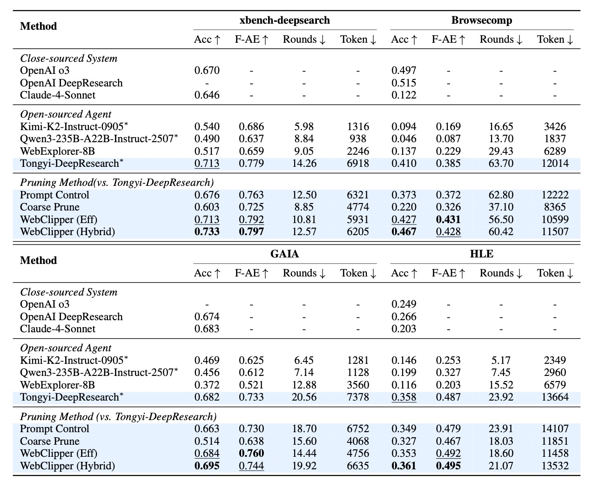

# AntAFu-DeepResearch: Towards Efficient and Effective DeepResearch

🎯 **AntAFu-DeepResearch** is developed by the AntAFu research team. We are dedicated to advancing the capabilities of deep research agents through innovative algorithms and rigorous evaluation.

> 🚀 *This is an ongoing project. We continue to push the boundaries of Deep Research agents and will regularly update this repository with new works.*

---

## 🔥 News
* **[2026-05]** 🎉 We have proposed **SlimSearcher**. an efficiency-aware training framework for web agents that reduces tool-call rounds by 17%–58% while maintaining or even improving accuracy.

* **[2026-04]** 🎉 **WebClipper** has been accepted to **ACL 2026 Main**! Our work on efficient web agent evolution via graph-based trajectory pruning achieves **~20% reduction in tool-call rounds** while improving accuracy. [Paper is available here](https://arxiv.org/pdf/2602.12852).

---

## 📦 Included Works

### 📄 WebClipper: Efficient Evolution of Web Agents with Graph-based Trajectory Pruning

[]()

**Authors**: Junjie Wang, Zequn Xie, Dan Yang, Jie Feng, Yue Shen, Duolin Sun, Meixiu Long, Yihan Jiao, Zhehao Tan, Jian Wang, Peng Wei, Jinjie Gu

<div align="center">
  
</div>

#### 🎯 Motivation
Deep Research systems based on web agents have shown strong potential in solving complex information-seeking tasks, yet their **search efficiency remains underexplored**. We observe that many state-of-the-art open-source web agents rely on **long tool-call trajectories** with cyclic reasoning loops and exploration of unproductive branches.

#### 💡 Key Idea
WebClipper addresses this by **compressing web agent trajectories via graph-based pruning**:
- Models the agent's search process as a **state graph**
- Casts trajectory optimization as a **Minimum-Necessary Directed Acyclic Graph (MNDAG)** mining problem
- Produces pruned trajectories that preserve essential reasoning while eliminating redundant steps

#### 🔧 Methodology (4-Stage Framework)

| Stage | Component | Description |
|-------|-----------|-------------|
| 1️⃣ | **State Graph Construction** | Transform raw trajectories into state graphs by abstracting agent actions and environmental information as nodes |
| 2️⃣ | **MNDAG Mining** | Mine an approximate minimal necessary DAG connecting initial query to final answer; redundant actions are pruned using Dijkstra-based shortest path + backward closure |
| 3️⃣ | **Coherence-Aware Rewriting** | Rewrite agent's thoughts on pruned trajectories with PPL-based selection to ensure semantic consistency |
| 4️⃣ | **Agent Evolution** | Fine-tune base agents on pruned trajectories with two strategies: (a) Efficiency-oriented evolution, (b) Hybrid evolution (balanced) |

#### 📊 Key Results

Evaluated on 4 benchmarks (**xbench-deepsearch**, **BrowseComp**, **GAIA**, **HLE**):

<div align="center">
  
</div>

- **Reduces tool-call rounds by ~20%** while improving or maintaining accuracy
- Introduces **F-AE Score** (Accuracy-Efficiency F-score) for balanced evaluation


## ⚡️ Released Resources

| Work | Code | 
|------|------|
| WebClipper | [📁 WebClipper/](WebClipper/) |

---

## 🚀 Quick Start

### Repository Structure

```
AQ-DeepResearch/
├── WebClipper/
│   ├── state_graph_build.py            # Stage 1: Build state graph
│   ├── mine_dag_and_message_refine.py  # Stage 2: Mine DAG and refine messages
│   ├── requirements.txt
│   ├── .env
│   └── README.md
├── assets/
├── LICENSE
├── LEGAL.md
└── README.md
```

### WebClipper Usage

#### Step 1: Environment Setup

```bash
cd WebClipper
pip install -r requirements.txt
```

Create a `.env` file with your API credentials:
```env
# For state_graph_build.py
EXTRACTOR_API_KEY=your_extractor_api_key
EXTRACTOR_BASE_URL=your_extractor_base_url

# For mine_dag_and_message_refine.py
REWRITER_API_KEY=your_rewriter_api_key
REWRITER_BASE_URL=your_rewriter_base_url

# PPL model for candidate selection
PPL_MODEL_PATH=your_ppl_model_path
```

#### Step 2: Build State Graph

```bash
python state_graph_build.py \
  --input /path/to/raw_conversations.jsonl \
  --output /path/to/state_graph_result.jsonl
```

#### Step 3: Mine DAG and Refine Messages

```bash
python mine_dag_and_message_refine.py \
  --input /path/to/state_graph_result.jsonl \
  --output /path/to/refined_trajectory.jsonl
```

For more details, please refer to [WebClipper/README.md](WebClipper/README.md).

---

## 🔮 Upcoming Works

We are actively working on several exciting projects that will be added to this repository soon. Stay tuned!

---

<div align="center">

**⭐ If you find our work helpful, please consider starring this repository! ⭐**

</div>
